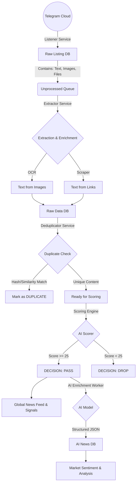

# Rubik Analytics - News Pipeline: Start-to-End Documentation

## 1. Executive Summary

The **News Pipeline** is the backbone of Rubik Analytics' real-time intelligence system. It acts as a funnel that ingests thousands of unstructured message signals from Telegram, filters out noise and spam, processes complex media (images/links), and delivers high-quality, scored financial news ready for trading signals.

The system runs autonomously as a set of four sequential background workers.

---

## 2. Pipeline Data Flow

The data travels through four distinct stages of transformation:

---

## 3. Detailed Process Breakdown

### Stage 1: The Raw Listener (`telegram_raw_listener`)
* **Goal**: Capture everything, miss nothing.
* **Mechanism**: Uses `Telethon` to connect as a user/bot to Financial Telegram Channels.
* **Functionality**:
    *   Listens to `NewMessage` events in real-time.
    *   **Media Handling**: Automatically detects images. If an image is found, it downloads it to `data/media_cache`.
    *   **Storage**: Saves the raw event (Message ID, Chat ID, Text, File Path) to `telegram_listing.duckdb`.
    *   **Status**: Marked as `is_extracted = FALSE`.

### Stage 2: The Extractor & Enricher (`telegram_extractor`)
* **Goal**: Convert unstructured media into analyzeable text.
* **Mechanism**: Polls `telegram_listing` for new items.
* **Key Features**:
    *   **OCR (Optical Character Recognition)**:
        *   Uses `Tesseract 5.0` to read text embedded in images (e.g., screenshots of earnings, press releases).
        *   **Spell Check**: Uses `pyspellchecker` to fix OCR errors (e.g., `pr0fit` -> `profit`).
    *   **Link Scraping**:
        *   Detects URLs in text.
        *   Visits the website (with a 10s timeout).
        *   Extracts the main body text (up to 3000 chars), stripping unwanted ads/scripts.
    *   **Normalization**: Converts all text to lowercase, removes special characters.
    *   **Output**: Saves to `telegram_raw.duckdb`.

### Stage 3: The Deduplicator (`telegram_deduplication`)
* **Goal**: Eliminate noise and repetition.
* **Mechanism**: Checks recent history (24 hours) for similarities.
* **Logic**:
    *   **Exact Match**: Computes MD5 Hash of content. If it exists in DB -> **DROP**.
    *   **Near Match**: Uses Jaccard Similarity. If content is >85% similar to a previous message -> **DROP**.
    *   **Safety**: Ensures that the *Scoring Engine* never sees the same news twice.

### Stage 4: The Scoring Engine (`news_scoring`)
* **Goal**: Evaluate relevance and filter spam.
* **Mechanism**: Applies a weighted scoring model to every *unique* message.
* **Decision Gate**: Only messages with a **Final Score >= 25** pass through.

### Stage 5: AI Enrichment (`news_ai`)
* **Goal**: Extract semi-structured financial data from scored news.
* **Mechanism**: Uses the active AI configuration (OpenAI, Gemini, or Ollama).
* **Functionality**:
    *   **Context Injection**: Injects the news text into a structured prompt.
    *   **Information Extraction**: Extract category, sub-type, company name, ticker, exchange, headline, summary, and sentiment.
    *   **Time-Window Deduplication & Merging**:
        *   Checks `final_news` for similar content within the last **60 minutes**.
        *   Uses **Hybrid Similarity**: Headline (Levenshtein) + Content (Word Overlap) + Entities > 80%.
        *   **Duplicate Storage**: If a duplicate is found, it is saved in the database with `is_duplicate=TRUE` and `duplicate_of_id=ORIGINAL_ID`. **It is NOT shown as a duplicate card.**
        *   **Merging Strategy**: 
            *   The *Original* (first) news item is treated as the primary source.
            *   When a duplicate arrives, the system *updates* the original item's `source_count` and adds the new source handle to `additional_sources`.
            *   **Source Links**: The News Card preserves the **URL of the first source** (fastest provider) as the main link. Secondary sources are acknowledged via the "Reported by X Sources" badge, but their specific URLs are consolidated to keep the UI clean.
    *   **Content Validation**: Explicitly drops news with `summary` length < 50 characters to prevent empty cards.
    *   **Structured Storage**: Saves the enriched data to `news_ai.duckdb` for downstream use in signals and dashboards.

#### Scoring Components (The "Brain")

The final score (`0-100`) is the sum of four components. A score of **25 or higher** is required to pass.

| Component | Logic | Max Points |
|-----------|-------|:----------:|
| **1. Structure** | Rewards information density.  • Length > 200 chars: **+20**  • Length > 100 chars: **+10**  • Contains Links: **+10**  • Contains Numbers/Dates: **+5** | **35** |
| **2. Keywords** | Scans for specific stock signals.  • **+10** for each Category Matched (see below).  • **-20** (Penalty) if Spam Keywords found. | **35** |
| **3. Source** | Trusted financial outlets get a priority boost.  • **+5** for Trusted Sources (Reuters, Bloomberg, NSE, BSE, etc.)  • **0** for Unknown/General sources. | **5** |
| **4. Content** | Rewards richness of data format.  • Text + Link: **+25** (Gold Standard)  • Text Only: **+20**  • Image (OCR) Only: **+15** | **25** |

### Stage 6: Real-time Delivery (WebSocket)
* **Goal**: Deliver updates instantly to the frontend ( < 500ms latency).
* **Mechanism**: WebSocket broadcast with duplicate prevention.
* **Message Types**:
    *   `new_news`: A fresh, unique news item. Frontend prepends this to the feed.
    *   `update_news`: A duplicate was detected. Frontend updates existing card (Source Count ++).
*   **Drift Prevention**: Tracks recently broadcast IDs per connection to prevent double-posting on page refresh.

### Stage 7: Stability & Concurrency

The system employs a rigorous stability model to handle concurrent access between the high-throughput AI worker (Writer) and the API server (Reader):

1.  **Shared Database Handling (DuckDB)**:
    *   **Worker Process**: Validates and acquires the **Write Lock** for `final_news.duckdb`. It has exclusive write access.
    *   **API Server**: Attempts to acquire a lock. If the database is locked by the worker, it automatically gracefully falls back to **READ-ONLY mode**. This ensures the UI never hangs or crashes even during heavy ingestion.
    *   **Corruption Prevention**: The system distinguishes between "File Locked" errors (normal concurrency) and "WAL Corruption" (file integrity). It only triggers database recovery/wipe on proven corruption validation.

2.  **In-Memory Deduplication Cache**:
    *   To prevent race conditions where multiple workers (or rapid concurrent batches) might process duplicate news before the database commits, an ephemeral **In-Memory Cache** tracks fingerprints (MD5 of headlines) of recently processed items.
    *   This dual-layer check (Memory + DB) ensures zero duplicate broadcasts even under high load.

---

## 4. Signal Classification: The Keyword Dictionary

The Scorer uses a highly specific dictionary to classify news. A message receives **+10 points** for each category it matches, capped at 35 points for this section.

### ✅ Type A: Corporate Actions (85 Keywords)
*Events related to stock capital changes and shareholder value.*
> `results`, `dividend`, `bonus`, `split`, `rights issue`, `buyback`, `merger`, `acquisition`, `amalgamation`, `delisting`, `re-listing`, `esop`, `employee stock`, `record date`, `ex-date`, `cum-date`, `book closure`, `agm`, `egm`, `board meeting`, `qip`, `fpo`, `ipo`, `pre-open`, `trading window`, `insider trading`, `pledging`, `invocation`, `release pledge`, `scheme`, `takeover`

### ✅ Type B: Business Growth (45 Keywords)
*New orders, expansion, and strategic partnerships.*
> `order`, `contract`, `partnership`, `expansion`, `launch`, `commissioning`, `tie-up`, `moa`, `mou`, `joint venture`, `capex`, `capacity`, `production`, `manufacturing`, `commercial production`, `ramp-up`, `breakthrough`, `milestone`, `landmark`, `strategic`, `collaboration`, `alliance`, `consortium`, `technology transfer`, `export`, `infrastructure`

### ✅ Type C: Financials (35 Keywords)
*Quarterly results, profit alerts, and guidance.*
> `profit`, `revenue`, `sales`, `growth`, `margin`, `ebitda`, `pat`, `net profit`, `operating profit`, `q1`, `q2`, `q3`, `q4`, `fy24`, `fy25`, `fy26`, `quarter`, `half-yearly`, `annual`, `audited`, `unaudited`, `consolidated`, `standalone`, `guidance`, `outlook`, `forecast`, `projection`, `target revenue`, `ebit`, `cash flow`, `debt`

### ✅ Type D: Governance (30 Keywords)
*Regulatory news, board changes, and fraud investigations.*
> `approval`, `meeting`, `board`, `appointment`, `resignation`, `policy`, `regulation`, `compliance`, `sebi`, `rbi`, `irda`, `pfrda`, `nclt`, `sat`, `listing`, `delisting`, `suspension`, `resumption`, `circular`, `notification`, `amendment`, `clarification`, `fraud`, `probe`, `investigation`

### ✅ Type E: Market Activity (25 Keywords)
*Bulk deals, volume shocks, and technical breakouts.*
> `stake`, `investment`, `bulk`, `block deal`, `circuit`, `limit up`, `limit down`, `hammer`, `breakout`, `gap up`, `gap down`, `volume surge`, `delivery`, `fii`, `dii`, `promoter`, `holding`, `pledging`, `open interest`, `rollover`, `expiry`, `settlement`, `short covering`

### ❌ Type F: Spam & Noise (45 Keywords)
*Penalty Trigger: -20 Points*
> `buy`, `sell`, `target`, `stoploss`, `recommendation`, `call`, `tip`, `multibagger`, `rocket`, `moon`, `pump`, `dump`, `breakout stock`, `penny stock`, `cheap`, `undervalued`, `bargain`, `hidden gem`, `explosive`, `massive`, `jackpot`, `superhit`, `winner`, `champion`, `monster`, `crazy`, `insane`, `unbelievable`, `mind blowing`, `life changing`, `wealth creation`, `riches`, `join`, `channel`, `group`, `premium`, `signals`, `accuracy`, `guaranteed`, `100%`, `free tips`, `paid service`, `subscription`, `whatsapp`, `telegram`, `discord`, `resistance`, `support`, `rsi`, `macd`, `supertrend`, `live stream`, `live streaming`, `streaming`, `webinar`, `scalping`, `scalp`, `intraday`, `btst`, `stbt`, `course`, `class`

### ✅ Type B: Business Growth (45 Keywords)
*Events indicating company expansion and future revenue.*
> `order`, `contract`, `partnership`, `expansion`, `launch`, `commissioning`, `tie-up`, `moa`, `mou`, `joint venture`, `capex`, `capacity`, `production`, `manufacturing`, `commercial production`, `ramp-up`, `breakthrough`, `milestone`, `landmark`, `strategic`, `collaboration`, `alliance`, `consortium`, `technology transfer`, `export`, `infrastructure`

### ✅ Type C: Financials (35 Keywords)
*Key performance indicators reported in quarterly/annual filings.*
> `profit`, `revenue`, `sales`, `growth`, `margin`, `ebitda`, `pat`, `net profit`, `operating profit`, `q1`, `q2`, `q3`, `q4`, `fy24`, `fy25`, `fy26`, `quarter`, `half-yearly`, `annual`, `audited`, `unaudited`, `consolidated`, `standalone`, `guidance`, `outlook`, `forecast`, `projection`, `target revenue`, `ebit`, `cash flow`, `debt`

### ✅ Type D: Governance (30 Keywords)
*Regulatory and management updates.*
> `approval`, `meeting`, `board`, `appointment`, `resignation`, `policy`, `regulation`, `compliance`, `sebi`, `rbi`, `irda`, `pfrda`, `nclt`, `sat`, `listing`, `delisting`, `suspension`, `resumption`, `circular`, `notification`, `amendment`, `clarification`, `fraud`, `probe`, `investigation`

### ✅ Type E: Market Activity (25 Keywords)
*Trading data and large flow indicators.*
> `stake`, `investment`, `bulk`, `block deal`, `circuit`, `limit up`, `limit down`, `hammer`, `breakout`, `gap up`, `gap down`, `volume surge`, `delivery`, `fii`, `dii`, `promoter`, `holding`, `pledging`, `open interest`, `rollover`, `expiry`, `settlement`, `short covering`

### ❌ Type F: Spam & Noise Filters (Penalty -20)
*Retail speculation, tips, and promotional content.*
> `buy`, `sell`, `target`, `stoploss`, `recommendation`, `call`, `tip`, `multibagger`, `rocket`, `moon`, `pump`, `dump`, `breakout stock`, `penny stock`, `cheap`, `undervalued`, `bargain`, `hidden gem`, `explosive`, `massive`, `jackpot`, `superhit`, `winner`, `champion`, `monster`, `crazy`, `insane`, `unbelievable`, `mind blowing`, `life changing`, `wealth creation`, `riches`, `join`, `channel`, `group`, `premium`, `signals`, `accuracy`, `guaranteed`, `100%`, `free tips`, `paid service`, `subscription`, `whatsapp`, `telegram`, `discord`, `resistance`, `support`, `rsi`, `macd`, `supertrend`

---

## 5. Technical Reference (File Structure)

### Databases (DuckDB)
*   **Listener**: `data/News/Raw/telegram_listing.duckdb` (Raw Stream)
*   **Extractor**: `data/News/Raw/telegram_raw.duckdb` (Processed & Deduped)
*   **Scorer**: `data/News/Scoring/news_scoring.duckdb` (Final Decisions)
*   **AI Enrichment**: `data/News/Final/news_ai.duckdb` (Enriched Structured News)

### Service Entry Points
*   `app.services.telegram_raw_listener.main`
*   `app.services.telegram_extractor.main`
*   `app.services.telegram_deduplication.main`
*   `app.services.news_scoring.main`
*   `app.services.news_ai.main`

---
*Documentation updated: 2026-01-15*
